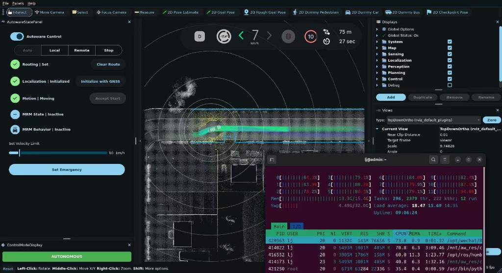
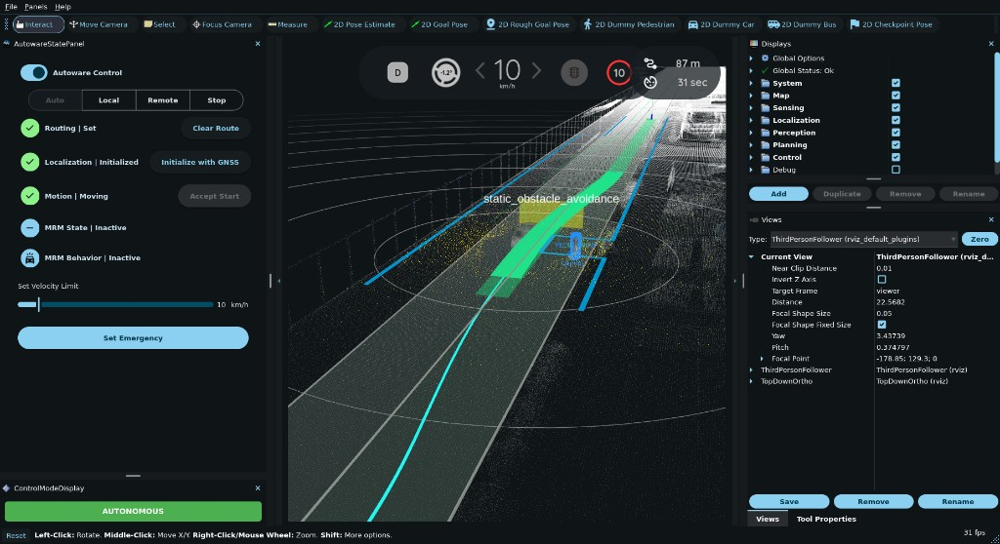

# autoware-planning

Autoware **决策规划**领域笔记与实验代码。

按规划三层组织：

| 目录 | 能力 |
|------|------|
| [`global-route/`](global-route/) | 全局路径 / mission / route |
| [`behavior/`](behavior/) | 行为决策（绕障、变道等） |
| [`motion/`](motion/) | 运动规划（轨迹速度、obstacle stop/cruise） |

实验脚本在 [`scripts/carla-town01-avoidance/`](scripts/carla-town01-avoidance/)。

相关领域（感知 / 定位 / 控制 / 地图·V2X / 平台）各自独立仓库，不放在这里。

---

## 今天做了什么（2026-08-04）

在 **CARLA Town01 + Autoware Humble light e2e** 上跑通 **静态障碍左绕**（`static_obstacle_avoidance`）。

- 容器名：`aw_carla_sim`
- 自车能对右侧偏置行人生成 **left shift**，横向离开车道中心绕行
- 修掉了「只停不绕」的常见坑：终点被改到自车附近 → 障碍被标成 `others_too_near_to_goal`

详细结论见：[`behavior/obstacle-avoidance/README.md`](behavior/obstacle-avoidance/README.md)

### 实验截图

Autonomous 行驶中（Town01，约 7–10 km/h）：



`static_obstacle_avoidance` 左绕：黄框为障碍，绿色轨迹向左偏出车道中心：



---

## 快速开始（本机路径）

> 下列路径对应当前实验机布局。若你换机器，把 `/mnt/aw_res/docker` 理解成「Autoware docker 脚本目录」，把容器内 `/home/aw/aw_docker` 换成脚本挂载点。

### 1. 启动联仿

```bash
export DISPLAY=:1 RVIZ=true CARLA_OFFSCREEN=1 OBJECT_SOURCE=dummy
/mnt/aw_res/docker/start_carla_e2e_light.sh
```

- 不要按 RViz **Emergency**
- 等 Localization = Initialized、Routing 可设

仓库中对应副本：

- `scripts/carla-town01-avoidance/start_carla_e2e_light.sh`
- `scripts/carla-town01-avoidance/drive_light.sh`
- `scripts/carla-town01-avoidance/dev-humble-carla.compose.yaml`

### 2. 一键绕障（推荐）

自车稳定后：

```bash
docker exec aw_carla_sim bash /home/aw/aw_docker/rerun_bypass_block.sh
```

脚本会：

1. 在自车前方约 12 m、车道中心偏右约 0.7 m 放固定行人（`inject_one_right.py`）
2. 设远端终点，**`allow_goal_modification: false`**
3. 热更新绕障参数 / 放宽部分 `obstacle_stop`
4. Engage Autonomous，并采样 pose

仓库副本：`scripts/carla-town01-avoidance/rerun_bypass_block.sh`

### 3. 关键检查

```bash
# 应看到 avoidable_target_*，不要是 others_too_near_to_goal
docker exec aw_carla_sim bash -lc '
  source /opt/ros/humble/setup.bash && source /opt/autoware/setup.bash
  timeout 3 ros2 topic echo \
    /planning/scenario_planning/lane_driving/behavior_planning/behavior_path_planner/debug/static_obstacle_avoidance \
    --once | grep ns: | sort | uniq -c | sort -rn | head
'

# 应看到 left shift
docker exec aw_carla_sim bash -lc '
  source /opt/ros/humble/setup.bash && source /opt/autoware/setup.bash
  timeout 3 ros2 topic echo /planning/planning_factors/static_obstacle_avoidance --once \
    | grep -E "shift_length:|detail:" | head
'
```

成功时大约会看到：`detail: left shift`，自车 y 从约 `-2.0` 移到约 `-0.6`（向左绕开右侧障碍）。

---

## 关键结论

### 为什么「只停不绕」？

| 现象 | 原因 |
|------|------|
| RViz 只有 `obstacle_stop` / `obstacle_slow_down`，路径仍是直线 | Behavior 没产出横向 shift，只剩 Motion 纵向停车 |
| debug `ns: others_too_near_to_goal` | 终点被 `allow_goal_modification` 吸到自车附近，障碍落入 goal 过滤距离 |
| debug `ns: others_out_of_target_area` | 障碍已在车后方 / 不在前向检测区 |
| 车飞走 / CARLA 里没有 ego | 同步模式下又开了第二个 `carla.Client` 并 `tick` / 销毁车辆 |

### 怎么让绕障生效？

1. **终点**：`allow_goal_modification: false`，终点远离障碍（例如前方 +80 m）
2. **过滤**：`object_check_goal_distance` ≈ `5.0`（见 planning_overrides）
3. **障碍位置**：相对车道中心横向约 **0.7–1.4 m**（太贴中心易只停；太靠边可能直行擦过）
4. **注入方式**：用地图**固定坐标**（`inject_one_right.py` + `PED_X`/`PED_Y`），不要用「跟着自车走」的 inject
5. **不要**在 bridge 占用 sync mode 时再开第二个 CARLA client 乱 tick

---

## 仓库结构

```text
autoware-planning/
├── README.md                          # 本文件
├── global-route/                      # 全局路径笔记
├── behavior/
│   └── obstacle-avoidance/            # 绕障实验笔记
├── motion/                            # 运动规划笔记（obstacle_stop 等）
├── docs/
│   ├── images/                        # 实验截图
│   └── repo-layout.md                 # 多仓库划分约定
└── scripts/
    └── carla-town01-avoidance/        # 本次实验脚本与参数
        ├── start_carla_e2e_light.sh
        ├── drive_light.sh
        ├── inject_one_right.py
        ├── rerun_bypass_block.sh
        ├── apply_fast_avoidance.sh
        ├── force_engage.sh
        ├── planning_overrides/        # BPP / MVP / validator 覆盖参数
        ├── AVOIDANCE.md
        └── ...
```

---

## 脚本一览

| 文件 | 作用 |
|------|------|
| `start_carla_e2e_light.sh` | 启动 CARLA（若未起）+ Autoware light e2e |
| `drive_light.sh` | 传送自车、设 pose、设路线、engage |
| `start_dummy_objects.sh` | `OBJECT_SOURCE=dummy\|inject\|static\|...` |
| `inject_one_right.py` | 固定地图坐标右侧行人（`PED_X`/`PED_Y`） |
| `inject_dummy_pedestrian.py` | 相对自车前方+横向注入（会跟车，demo 慎用） |
| `rerun_bypass_block.sh` | **推荐**：前方近中心线行人 + 远终点绕行 |
| `rerun_bypass_ahead.sh` | 前方偏右行人绕行 |
| `bypass_no_carla_touch.sh` | 只动 ROS，不调用 CARLA API |
| `apply_fast_avoidance.sh` | 热更新绕障相关 ROS 参数 |
| `force_engage.sh` | 清急停并进 Autonomous |
| `go_auto.sh` | inject + pose/route + engage 一键 |
| `enable_rviz_dummy.sh` | 恢复 RViz 2D Dummy 放置 |
| `ogm_free_publisher.py` | 空闲占用栅格（perception:=false 时） |
| `dummy_traffic_signals.py` | 假交通灯 |
| `planning_overrides/` | 规划参数覆盖（bind-mount 用） |

把脚本同步到运行环境示例：

```bash
# 本机：仓库 → docker 挂载目录
cp -a scripts/carla-town01-avoidance/*.sh scripts/carla-town01-avoidance/*.py \
  /mnt/aw_res/docker/
cp -a scripts/carla-town01-avoidance/planning_overrides/. \
  /mnt/aw_res/docker/planning_overrides/
```

容器内通常通过 `/home/aw/aw_docker/` 访问同一批文件（compose 挂载）。

---

## 规划参数（overrides）

目录：`scripts/carla-town01-avoidance/planning_overrides/`

重要项：

- `static_obstacle_avoidance.param.yaml`
  - `use_lane_type: opposite_direction_lane`
  - `object_check_goal_distance: 5.0`（避免 mid-route 目标被当 near-goal 丢掉）
  - `yield.enable: false`（优先横移而不是让行停车）
- `obstacle_stop.param.yaml`：给绕障路径更多时间再硬刹
- `drivable_area_expansion.param.yaml`：左边界扩展，便于借入邻/对向视觉车道
- `scene_module_manager.param.yaml`：允许 avoidance 与 lane change 协同

热更新（无需重建容器，部分参数）：

```bash
docker exec aw_carla_sim bash /home/aw/aw_docker/apply_fast_avoidance.sh
```

完整挂载生效需重建 `aw_carla_sim`（见 compose）。

---

## 地图前置（Town01）

不在本仓库维护地图文件，但绕障依赖：

- `one_way=no` + reverse lanelets
- shared bounds：`lane_change=yes`（`patch_town01_shared_bounds.py`）

细节归 **地图 / HDMap** 仓库。

---

## 排障清单

1. Localization 是否 Initialized？
2. 终点是否被改近？看 `/planning/mission_planning/route` 的 `goal_pose`
3. avoidance debug `ns:` 是 `avoidable_target_*` 还是 `too_near_to_goal`？
4. 是否有第二个 CARLA client？
5. Velocity Limit 是否过低 / Motion 是否一直 Stopped？
6. 内存是否过紧（本机 16G 时 CARLA+Autoware 较紧）

停止联仿：

```bash
docker rm -f aw_carla_sim
killall -9 CarlaUE4-Linux-Shipping   # 若也要关 CARLA
```

---

## 许可与说明

个人学习 / 实验记录。脚本针对特定本机挂载路径；移植时请改路径与 compose。
